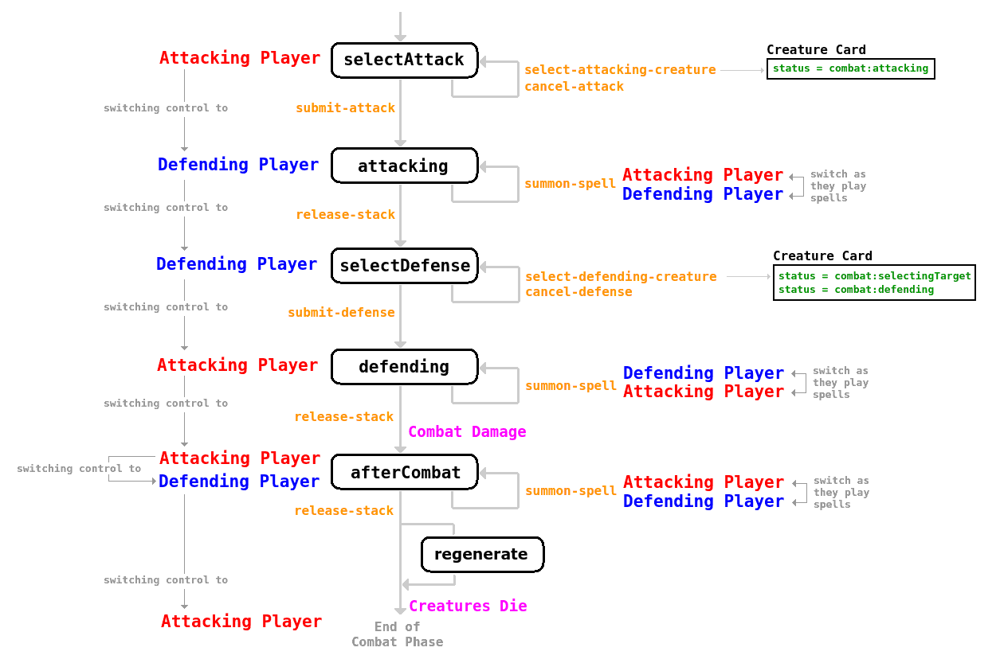

# JB-MTG

An online version of the **_Magic the Gathering_** card game (vintage)<br/>
<br/>
As a fan player in my childhood, I wanted to recreate the game as it was 30 years ago, so I could play my friends online.<br/>
So far I've managed to build a stable engine that works with an internal framework that allows coding different cards (up to 175 cards so far).
The complexity of the game scales as each card may change the rules again, add new modals, or redefine current card properties.
<br/>


## Main Features

This is not only a 2 player game. It is meant to recreate the whole **_Magic the Gathering_** online.<br/>
For this reason, as a user, you can collect cards (buy and sell them), create your own decks with them, and play other users.<br/>

### Navigation
You can navigate to the different sections of the game through the left menu panel.
There are 3 basic sections:
- [Your Cards](#your-cards)
- [Library](#library)
- [Games](#games)

#### Your Cards
Here you can see all the cards you own, and how many units of them you own.<br/>


> [!NOTE]
> You can group your cards. That means that if you have 10 units of the same card, instead of showing 10 images of the same card it will show only 1, and tell you the quantity after the name in `()`. This will help you find them more easily when building decks.<br/>
Regadless of the `group` check, you will always see all your units on the left side panel.

You can also expand the deck builder on the right hand side, to select/unselect cards from/to your decks.


> [!TIP]
> Every card unit someone owns has a unique ID that is composed by 2 parts: The card code (like `c000123`) and the unit code (like `u0075`). The former tells you what card it refers to, and the latter the unit identifier. <br/>
Example: `c000012.u0005` refers to the 5th unit of the card with code `c000012` (Black Lotus). There are up to 20 units of `c000012`.


#### Library

Here you can see all the existing cards in the game (owned by anyone)

You can select one card and it will take you to a list of all existing units of that card. You can see the options to **Buy** or **Sell** units, depending on if you own them or if anyone is offering a unit for sale.


#### Games

On this page you can challenge other users play a game.
You can select what deck you want to play with, and send a request to the other user. Once they accept it, a game will start, and the game view will be displayed.


## Game
> [!CAUTION]
> It is recommended that both players are using the app at the same time while playing a game. Otherwise the timeouts will slow it down a lot.<br/>

The game should be very intuitive if you have already played **_Magic the Gathering_** with real cards.<br/>

On the left side you will see the player's decks, graveyards, mana pools and life points. Large between them there is a card view to inspect whatever card you want on the game, just hover over a card and it will open the image there.<br/>
There is also a column showing all the phases of the game for each player, and highlighting the current one.<br/>
Your player is always at the bottom, and your opponent at the top of the screen.

> [!NOTE]
> Your player is always at the bottom, and your opponent at the top of the screen.

If you want to perform an action that requires a card, you can click the card to do so. Notice that hovering the card will display a tooltip explaining what action you are about to perform.<br/>
Options that do not require a card are displayed as a button in the middle of the screen, between you and your opponent.

> [!TIP]
> Cards that can perform an action in the current situation are highlighted with a blue shadow.


### Timers

Since the game is based on a constant interaction between the 2 players, where spells can be cast and interrupted at any time, some timers have been added to ease the user experience. That is, when a player performs an action that can be modified by the opponent, a short window of time opens for him/her to play. By default a timeout will close that window after a few seconds, but if needed the player can stop that (`Wait` button) and perform whatever counter-action is needed.
On the other hand, if no counter-action, the opponent can immediately skip the timer and close and go on with the game (`Ok, go on` button).


## Backend Support

This project works with **Firebase** (Google Cloud), using its real time DB (Firestore).<br/>
This allows a seamless experience when the 2 players trigger actions, since they are immediately reflected on the other player.

The state machine is currently running on the front-end, although I might replicate it to the back-end one day, to double-check players do not cheat changing invalid states. So far I'll trust my friends are not capable to do so.


## Coding Cards

You can find the list of all cards with their static properties in [dbCards.ts](./src/app/core/dbCards.ts).<br/>
That info is replicated into a static file so it does not need to be loaded from DB every time we load the game.<br/>


Then, you can find all the specific logic for every card coded in [game.card-specifics.ts](./src/app/pages/games-room/game/gameLogic/game.card-specifics.ts)<br/>
There the same static card object is extended with some methods that will be called during specific moments on the game (when the abilities are required):
```
- onSummon()          : What the card does when it's summoned
- onAbility()         : What the card does when it's used for its ability (tap...)
- onStack()           : What the card does when it's added to the stack
- onTarget()          : What the card does when a target is selected (in cardOp)
- onCancel()          : What the card does when the summoning operation is canceled (in cardOp)
- onDestroy()         : What the card does when it's destroyed
- onDiscard()         : What the card does when it's discarded
- onUpkeep()          : What the card does during the upkeep phase
- onEffect()          : What the effect of the card does when it's applied
- onPlayerDamage()    : When the card damages a player in combat
- onCreatureDamage()  : When the card damages a creature in combat
- afterCombat()       : What the card does after combat
- isType()            : Checks if the card is of a certain type
- isColor()           : Checks if the card is of a certain color
- canUntap()          : Whether the card can be normally untapped
- canAttack()         : Whether the creature can be selected to attack
- canDefend()         : Whether the creature can be selected to defend
- targetBlockers()    : List of attackers the current creature can block
- getSummonCost()     : Cost to summon the card
- getAbilityCost()    : Cost to trigger a card ability
- getUpkeepCost()     : Cost play the onUpkeep() action
- getCost()           : Generic cost getter
```

You can find the card object definition in [types.ts](./src/app/core/types.ts)

### Game Engine
The game stops every time a player can take some manual action.<br/>
When an action is triggered, the client calculates all the changes and updates the state of the game. 
From that update, every client calculates all possible next actions, grouping them on the `options[]` array so the next manual action can be selected.

Actions are composed from a "verb" (action) + some extra parameters, like gId to tell what card the action is being applied to.

Example:
```
this.game.action('skip-phase');
this.game.action(card.selectableAction.action, { gId: card.gId });
```

You can see the state management trigger in [game-state.service.ts - action()](./src/app/pages/games-room/game/gameLogic/game-state.service.ts#L253)

### Summon/Trigger Cards
The most common actions in the game are summoning a card or triggering a card's ability. Both usually require a cost (pay mana) and sometimes targets.
To ease the selection of the cost (mana) and targets, a multi-action operation is remembered, so the player can pause the action to perform other actions that will help pay the cost.

When you try to pay mana to summon or trigger an ability, depending on the mana in your mana pool, you may have different situations:

1. **If you have the exact mana in your mana pool** →		The action is triggered automatically, spending the current mana in the mana pool.

2. **If there's not enough mana in your mana pool** → 		The summon action gets paused waiting for more mana and a card operation (`cardOp`) starts with `status = waitingMana`.<br/>
You may trigger other actions in order to generate mana. Every state update the cardOp (controller) will check the mana pool and try to summon the creature again (if more mana detected).

3. **If there's more mana than needed in your mana pool** → 	There are 2 possible cases here:

    1. **auto (no cherry picking)** →	If the summoning doesn't require uncolored mana, or there is only 1 mana color where to take it from, it summons the card directly.

    2. **manual (cherry picking)** → 	If the summoning requires uncolored mana, and there are different mana colors to be used, the summon action gets paused and a `cardOp` starts (with `status = selectingMana`) to trigger a manual step to select what mana is used for the uncolored summon.<br/>
		The controller will allow you to manually reserve mana from your pool for the summoning (manual summoning process).<br/>
		Once you have manually reserved enough mana, a "Summon button" gets enabled, and allows you to trigger the action again, passing the param `manaForUncolor[]` that specifies what colored mana should be used for the uncolored cast.


In the controller, both the `summon:waitingMana` and `summon:selectingMana` temporarily states are handled with the summonOp object.
You can cancel the summon operation at any moment, triggering the `'cancel-summon-*` action.

CardOp statuses:

**waitingMana**:	When waiting for mana, you can trigger other actions in order to add mana into the mana pool. 
Every time the state changes (other actions triggered), the controller checks (tryToSummon) the available mana in the mana pool for the new state, and if possible, triggers the `'summon-*'` action again.
It may happen that by adding more mana while waiting, you result in having more mana than needed and need to cherry pick (option 3.b above). In this case the card.status changes to `'summon:selectingMana'`, and the summonOp is restarted in 'selectingMana' mode.

**selectingMana**:	When selecting mana manually, the controller creates a temporary **reserved mana pool**, so you can cherry pick from your mana pool to your reserve (one by one).
You should click the colors in your mana pool in order to move mana from the pool to the reserved pool (`manaPool[]` → `summonOp.manaReserved[]`).
The controller also shows a dialog where you can see the current reserved mana pool, while the original mana pool displays its value minus the reserved.
If you cancel the summon operation, all your reserved mana goes back to your mana pool (it resets the `summonOp`).
When selecting a mana from your mana pool, summonOP checks whether you have enough mana to summon with that. If so, it enables the "summon" button on the dialog, so you can trigger the `'summon-creature'` action again (manually clicking it).
When you start the selecting mana summon operation, it automatically adds the colored mana into the reserved mana pool.

**selectingTargets**	Some cards need a target/s selection before the summoning. To allow the user select them, after the mana is sorted, there is this temporary state too.


When a card is summoned, a notification is shown to the opponent, telling about the operation and giving him control for a period of time, so he can cast instants/interruptions on the operation.

### Spell Stack
When certain actions can initiate a spell stack.<br/>
That means the action does not take effect immediately, since a series of N spells can be also cast during the operation. A stack is created, and they are all added to it. Once no more spells are added to the stack, they are executed sequentially in the reversed order they were added.


### Combat
The combat phase can be split in N sub-phases:



The combat starts with the initial sub-phase `selectAttack`:

**selectAttack** →	Here the attacker (turn's player) has control, and can cherry pick which creatures will be used to attack, through the action "select-attacking-creature", which also sets the creature's combatStatus = "combat:attacking".<br/>
In case he wants to start the selection again, or cancel it entirely, he can trigger "cancel-attack" action, which untaps and unselects all the previously selected creatures.<br/>
Once the selection is right, he ends this sub-phase triggering the "submit-attack" action. This moves the sub-phase to "attacking".

**attacking** → 		Here the attacker has initially a chance to cast spells or trigger abilities, before the defense is set. If spells are played the control is switched between the attacker and defender in the spell stack mechanism.<br/>
Once the attacker is done, it triggers the "continue-combat" action, and then the defender has a chance to do the same.<br/>
Once both players are done, this sub-phase ends and the defender player gets control for the next one.

**selectDefense** → 	Here the defender (other-turn's player) has control, and can cherry pick which creatures block which attacking creature, through the action "selecting-defending-creature".<br/>
When you first select a creature to defend, the action sets that creature's combatStatus = "combat:selectingTarget". Then when you select the target (attacking creature to defend), the creature's combatStatus = "combat:defending".<br/>
In case he wants to start the selection again, or cancel it entirely, he can trigger "cancel-defense" action, which unselects all the previously selected creatures.<br/>
Once the selection is right, he ends this sub-phase triggering the "submit-defense" action. This switches control to the defender player, and moves the sub-phase to "beforeDamage".

**beforeDamage** → 	Here the attacker (turn's player) has control initially.
Given the attacking and defending creatures, he can cast spells starting a spell stack. If that is the case, there's a shift in control between the attacker and defender, according to the playing spells.<br/>
Once all players are done casting spells and they trigger the "release-stack" action, this sub-phase ends and the combat damage is executed, showing all the damage points for every creature/player, and moving to the next sub-phase.

**afterDamage** → 	Here the attacker (turn's player) has control initially.
Now that the creatures have received damage, a spell stack can be initiated by both the attacker or the defender, in order to cast spells that save creatures from dying, or others.<br/>
Once both attacker and defender have released the stack by "release-stack", the combat ends and all creatures die (if they've received more damage than their defense).<br/>
It may happen that some creatures can be regenerated after they die. If so, the extra subphase "regenerate" is activated to allow players to regenerate them. Otherwise the combat ends and control is returned to the attacker.

**regenerate** → 	It allows player1 and player2 to trigger the regenerate ability of their dying creatures (see regenerate).
Once all creatures are either regenerated or dead, the combat phase ends. Control is always returned to the attacker after the combat.

<hr>
**Auto advance**: To ease the ux, there are some cases where the game controller will auto advance the sub-phase of the combat:
During your turn, if you don't have any creature that can attack, the whole combat phase is skipped.
If you are being attacked and have no creatures that can block the attackers, the selectDefense subphase is skipped
If you are being attacked and have no defending creatures, skip your defending subphase, because you already had the attacking subphase to cast spells.


### Effects

Every time a card plays an effect, this is added to the `state.effects[]` array.

Depending on the **scope** of the effect, the lifespan of the effect can be:

- **permanent** →	Effects that remain on play as long as the card that generated it is on the table (usually an enchantment)<br/>

- **turn** →		Effects that remain on play until the end of the turn (current, player1 turn or player2 turn depending on playerNum).<br/>

These effects take place until the end of the turn, even if the card that generated them was destroyed (instant spells, …)<br/>
There can be also different moments when the effect takes place (the `onEffect()` function on the card is called):

- **constantly**		→ These are applied constantly, for every state change. They constantly recalculate values like turnAttack, turnDefense, turnLandWalk.
- **onEndTurn**		→ These are applied only at the end of the turn (current turn, player1 turn or player2 turn depending on playerNum). Eg: Time Walk.
- **onDraw**		→ These are applied only when a player draws a card. Eg: Underworld Dreams
- **onAbility**		→ Each time a card triggers an ability the effect is triggered. We can filter the ability.code to watch for the appropriate hook.
- **durinSelAttack**	→ Applied after every state change when it's phase "combat" + sub-phase "selectAttack".
- **onEndUntap**			→ Applied once after the "untap" phase is finished
- **onEndUpkeep**		→ Applied once after the "upkeep" phase is finished
- **onEndDraw**			→ Applied once after the "draw" phase is finished
- **onEndPre**			→ Applied once after the "pre" phase is finished
- **onEndCombat**		→ Applied once after the "combat" phase is finished
- **onEndPost**			→ Applied once after the "post" phase is finished
- **onEndDiscard**		→ Applied once after the "discard" phase is finished
- **onEndSelectAttack**		→ Applied once after the "selectAttack" combat's sub-phase is finished
- **onEndAttacking**		→ Applied once after the "Attacking" combat's sub-phase is finished
- **onEndSelectDefense**	→ Applied once after the "SelectDefense" combat's sub-phase is finished
- **onEndBeforeDamage**	→ Applied once after the "BeforeDamage" combat's sub-phase is finished
- **onEndAfterDamage**	→ Applied once after the "AfterDamage" combat's sub-phase is finished


### Abilities
Every card may have certain abilities

Permanent abilities from creatures:
- **Flying** 		→ A flying creature cannot be blocked by a non flying creature. https://mtg.fandom.com/wiki/Flying
- **Trample**	→ An attacking creature with trample deals the excess damage (over defenders toughness) to the player. https://mtg.fandom.com/wiki/Trample
- **First Strike**	→ When dealing combat damage, if that kills the other attacking/defender, they don't receive any damage. https://mtg.fandom.com/wiki/First_strike
- **Haste**		→ They can attack the same turn they are summoned (they have no summoning sickness). https://mtg.fandom.com/wiki/Haste
- **Walls**		→ They cannot attack, only defend

Protection from color → The creature/permanent cannot be:
- The target of an enchantment of that color.
- Blocked by creatures that color.
- Targeted by spells of that color, or by abilities from sources of that color.
- Damaged by sources (instants or effects) from that color

### Regenerate
The ability to regenerate is a bit special.
When a creature can regenerate it has a flag on the card specs: `card.canRegenerate = true`.
However, the regeneration often requires a cost, so it is treated as a card ability (the only ability of the card so far).<br/>

When a creature is killed (damage >= defense) or destroyed, if it can be regenerated we set the flag `card.isDying = true` instead of sending it to the graveyard. Enchantments/effects are kept too.<br/>
When the state reducer detects a creature with the flag isDying, it immediately gives the game control to the creature's owner and opens the `<dialog-regenerate>`, showing the card to regenerate and activating its regenerate ability, so the operation to gather the ability cost starts immediately.<br/>
If you cancel the regenerate ability, the creature dies as it would've normally (it is sent to the graveyard).
If you pay the regenerate ability cost and regenerate the creature, the `turnDamage` is reset to 0 and the creature remains, along with all its enchantments and effects.<br/>
During the regenerate special step, you can also trigger other card's abilities (to generate mana).

### Upkeep
At the start of each player's upkeep phase, for every card that has an upkeep cost (`getUpkeepCost` returns !== null), a reference (with the card's gId) is added to the player's `upkeepQueue[]`<br/>
These are added sequentially by tableA[].order, and need to be resolved in that order.

You can't skip the upkeep phase until all the upkeepQueue items are `resolved = true`.
To resolve upkeep items you trigger the `"pay-upkeep"` action or `"skip-upkeep"` action, for the gId reference. Once that happens the `onUpkeep()` action on the card is executed, changing the state accordingly. <br/>
A parameter (`paid=true`) is passed, so we know whether the player has paid the upkeep or not.


### Life Changes
Every time a player receives damage and loses or gains life, a dialog opens to him/her to notify that (after the life's been subtracted/added).
At the same time, another dialog with the same info is shown to the opponent too.

The dialog remains on top (without other options available) until the player "acknowledges" it, and the game can continue.
Some dialogs have a timer that will automatically acknowledge them after a few seconds, so the game doesn't stop too much.

These are controlled from the `state.lifeChanges[]` array. Every card that deals damage or adds life will push a notification to that array, and the reducer will detect that, stop the game and show the dialog.
When the player is ok with the notification, it triggers the `"acknowledge-life-change"` action, and the dialog is removed (lifeChanges[] item is removed).

To allow players to "acknowledge" life changes, the game control switches temporarily to them. Once acknowledged it returns to the player who was playing (it's saved in `state.lifeChangesInitiatior`).

It may happen that an action deals damage/adds life to both players at the same time (eg. Earthquake).
In this case, 2 items are added to `state.lifeChanges[]`, one for each player. The first item is shown first, and once released the second is shown. There is also a control switch between the 2 players.


## ToDos
There are still some features I'd like to add in the future:
- [x] Add timer on spell stack to automatically trigger Ok after 5 seconds
- [x] Improve the mana burn dialog (and add a toast for the opponent)
- [ ] Effects
- [ ] Fix spell stack scroll box (calc height dynamically to set no scroll size)
- [ ] Fix summoning Brass Man (only uncolored mana)
- [ ] Support MultiType cards: Add extraType on cards, for "creature artifacts" or others
- [ ] Add toast for combat results
- [ ] Add toasts for spell stack execution
- [ ] Fix dragging cards on the table
- [ ] Reorder (card.order) when dragging on the table
- [ ] Reorder mana on the table on a same column
- [ ] Style panels properly
- [ ] 1900x1024 size adjustment
- [ ] Add chat
- [ ] Remove top bar + floating config panel (top-right)
- [ ] Visual element to show you have/don't have game control (very intuitively)
- [ ] Performance improvement: Do not save the static card properties (c0000) on the state.card[] objects. Merge those properties in memory every state change
- [ ] Split reducer to another service

## Mobile version
I am currently working on a suitable layout for mobile experience, but it's not ready yet (some modals css need to be adjusted yet).
It can be accessed by loading the same game route but with `game-mob` instead. Eg: `https://jb-mtg.netlify.app/game-mob/WvYPxRKiPZ4lCzuV3yH`


## Further help
This project was developed with [Angular](https://angular.dev/) version 17.3.4. <br/>
You can leave some comments on the project or contact [me](mailto:joel.barba.vidal@gmail.com) directly for more information.